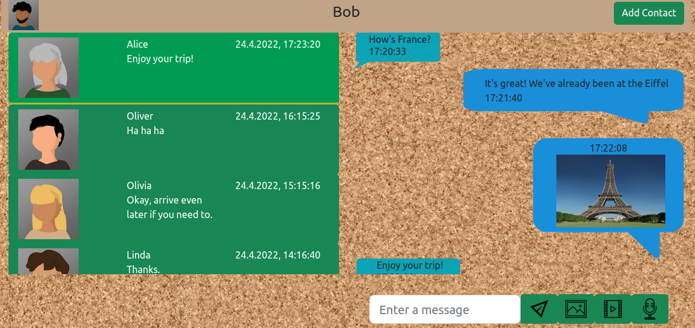

# Messaging Client
A Messaging Client built with React.\
Design was made with Bootstrap elements and CSS.\
The client supports sending text, images, videos and audio recording.\
Also included a multi-users experience with both register and login pages.\
Co-Created with Dor Sror.
# Existing users:
User Name | Nick Name | Password | Contacts
--- | --- | --- | --- |
bob123 | Bob | bob_pass | alice123, oliver123, olivia123, linda123, frank123
alice123 | Alice | alice_pass | bob123
oliver123 | Oliver | oliver_pass | bob123
olivia123 | Olivia | olivia_pass | bob123
linda123 | Linda | linda_pass | bob123
frank123 | Frank | frank_pass | bob123

# Running
1. Create a new project:  
`npx create-react-app projectname`  
2. Copy both src and public folders to project directory (overwrite new files).  
3. Navigate to the project directory:  
`cd projectname`  
4. Install dependencies (JQuery, Bootstrap, React-Bootstrap and React-Router):  
`npm install react-bootstrap bootstrap react-router-dom jquery --save`
5. Start React:  
`npm start`  
6. Navigate to [http://localhost:3000](http://localhost:3000) in order to view it in your browser.  
# Screenshots
\
\
